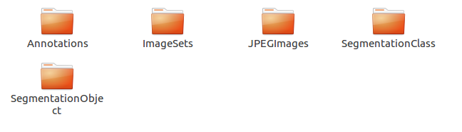
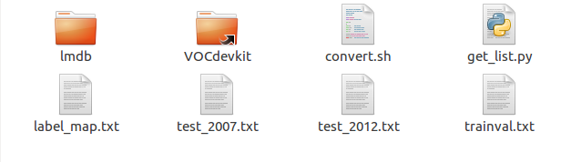
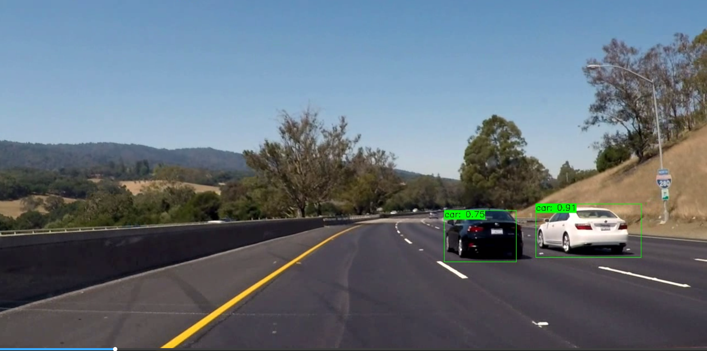

# Caffe-Vehicle-Detection

## 项目简介

本项目通过使用定制化Caffe框架训练YOLO模型，并对视频文件标记车辆的位置。

## 项目依赖

1. Caffe [下载地址](https://github.com/yeahkun/caffe-yolo)
2. OpenCV 3.4
3. CUDA 8.0+
4. NVIDIA DRIVER
5. python 2.7+

## 环境准备

### caffe编译

1. 下载caffe后，在根目录下修改Makefile.config.example名称为Makefile.config，做如下修改

```bash
    OPENCV_VERSION := 3
    CUDA_ARCH := -gencode arch=compute_xx, code-sm_xx \
                 -gencode arch=compute_xx, code=compute_xx
```

其中xx可以在[这里](http://blog.csdn.net/allyli0022/article/details/54628987)查找相应的计算能力并替换

2. 执行make all -j 进行编译

### 准备训练数据

1. 通过以下链接下载VOC训练、测试集，并将文件解压聚合到./data/yolo/VOCdevkit目录下。

```commandline
   http://host.robots.ox.ac.uk/pascal/VOC/voc2007/VOCdevkit_08-Jun-2007.tar
   http://host.robots.ox.ac.uk/pascal/VOC/voc2007/VOCtest_06-Nov-2007.tar
   http://host.robots.ox.ac.uk/pascal/VOC/voc2007/VOCtrainval_06-Nov-2007.tar
```

目录结构如图所示：



其中：
* Annotations 文件夹里面是.xml文件，放的是对应图片的坐标和尺寸信息。
* JOEGImage 文件夹里面放的就是图片。
* 两个Segmentation 开头的文件夹是和分割相关的，我们这里暂时不用。
* ImageSets 为具体的图片的文件名称。

执行以下命令解析目录文件，并生成标签映射表

```bash
    cd data/yolo
    python ./get_list.py
    mkdir lmdb && mkdir lmdb/trainval_lmdb
```

修改convert.sh中的ROOT_DIR=./后，执行图片转换脚本，将图片转换成lmdb存储格式。

```bash
    ./convert.sh
```

我们需要分别注解训练集和测试集的命令，使其在lmdb中生成trainval_lmdb和test2007_lmdb文件夹

最终生成目录结构如下：



## 开始训练

1. 由于YOLO的分类网络需要预训练，所以从一个训练好的网络模型中迁移过来，[下载地址](https://github.com/BVLC/caffe/tree/master/models/bvlc_googlenet)
2. 将文件下载的caffe根目录下，然后修改examples/yolo/train.sh，修改如下：
```bash
    WEIGHTS=$CAFFE_HOME/bvlc_googlenet.caffemodel
```
3. 执行如下命令
```bash
    mkdir models
    sh train.sh
```
最终会在models下产生权重模型

4. 可以通过test.sh文件运行测试集进行测试验证，检验模型准确度。

## 运行模型

在yolo_caffe_model.cpp项目根目录下设置protoPath、modelPath、imagePath，运行后，就可以对图片和视频进行预测了，效果如下：

 

## 总结

该项目通过对使用改造后的Caffe框架，实现了YOLO在Caffe下的模型实现，再通过OpenCV中的Caffe模型加载，进行预测，该项目在GPU下运行，能提供比较高的准确率同时保持搞帧率。